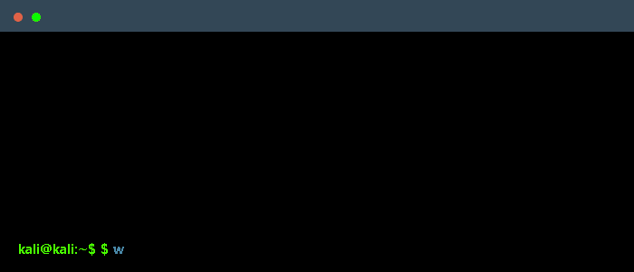

 

    

### Main skills

### Studying

### Connect with me!
     Fast links to my socials!

    
    

### Employer?
> [!IMPORTANT]  
> <a href="https://drive.google.com/drive/folders/" download>Download my resume</a>

